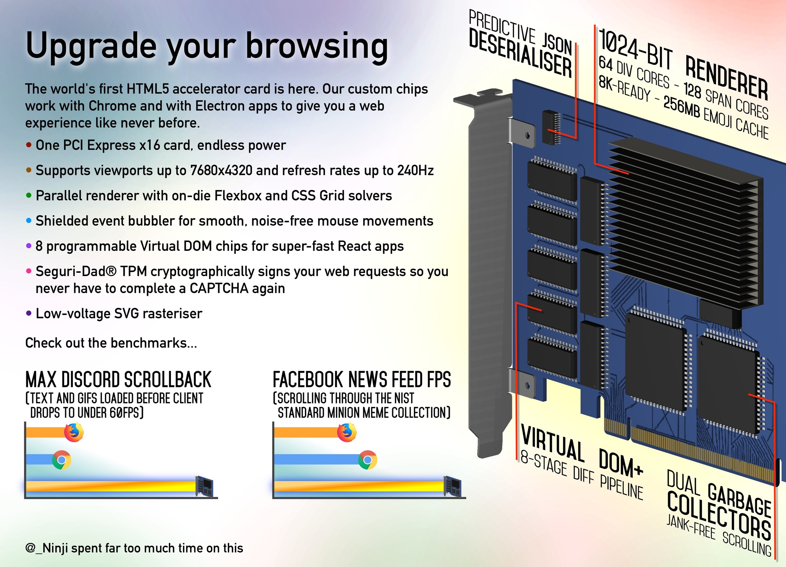
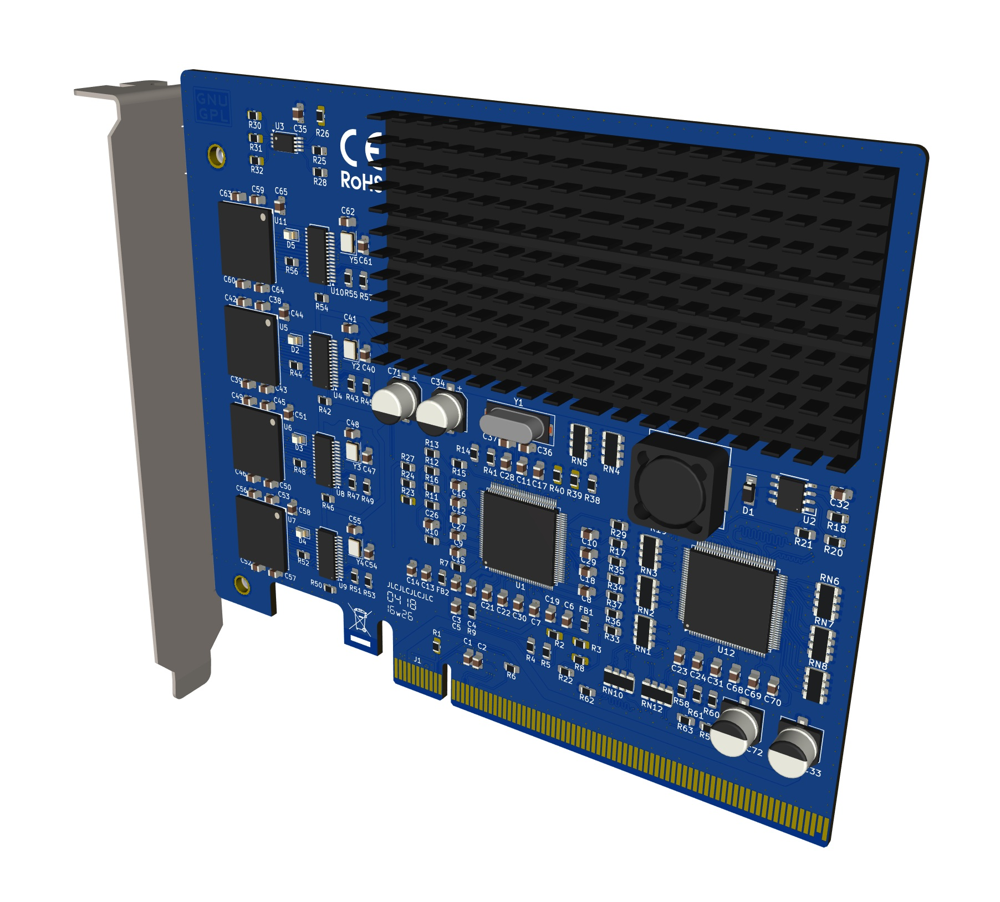

# HTML_Accelerator
 A wokring version of the fictional PCIE card modeled after:  
https://twitter.com/_Ninji/status/1317197426449633281

What I present to you today:

# Block Diagram

Made with https://app.diagrams.net/

## Signal Chain:
1. PCIE 1x (16x size)connection to PC  
2. 1x MCS9990 PCIE to USB2.0 port host controller  
3. 4x Alcor Micro AU6438BS USB to eMMC reader  
4. 4x eMMC storage iC mimic card inserted to reader 

## Windows Readyboost info:
https://en.wikipedia.org/wiki/ReadyBoost  
- Must be at least 256MB  storage  
- Access time of 1ms or less  
- 2.5MB/s read 4kb rand  
- 1.75MB/s write 512kb rand  
- up to 8 USB devices

# Notes:
MCS9990 reference schematic
https://www.asix.com.tw/en/product/Interface/PCIe_Bridge/MCS9990

AU6438 USB to EMMC reader pcb for reference:  
https://www.aliexpress.us/item/3256805090449780.html
with schematic: https://www.pcbway.com/project/shareproject/USB_flash_drive_AU6438.html  

PCIE pinout:  
https://pinoutguide.com/Slots/pci_express_pinout.shtml

## Hard to find chips:
Order for single PCB below. See BOM for more details.  
QTY 2: MCS9990IV or MCS9990CV (128pin LQFP 14x14mm)  
QTY 4: AU6438BS (SSOP28)  
QTY 4: H26M31003 (FBGA153 11.5x13mm)  

# Mechanical

### Heatsink
- 40x80 11h or 5h https://www.aliexpress.us/item/3256803900170018.html
- 33x73 3h https://www.aliexpress.us/item/3256807916453913.html 
 
### PCIE Bracket
- PCIE 85mm full height bracket without vent holes.   
This is actually impossible to find, I literally went to Shenzhen China in person June 2025, made friends with four differnt sellers and nobody has these anymore.

## Ordering info:
JLC PCB https://cart.jlcpcb.com/quote  
Est cost as of 4/18/26 = 118$ + 108$ assembly small stuff 31$ Shipping

PCBway https://www.pcbway.com/orderonline.aspx  
Est cost as of 4/18/26 = 244$ incl shipping (not including assembly)

| Detail | Spec |
| ------ | ---- |
| layers | 4 |
| dimensions | 110mm X 130mm |
| QTY | 5 |
| Product type | Industrial |
| PCB Thickness |1.6mm | 
| PCB Color | Blue |
| Silkscreen | white |
| Material Type | KB-6165 TG155 |
| Surface finish | ENIG |
| Outer/Inner cu weight | 1/0.5oz |
| Specify Stackup | JLC04161H-7628 |  
| Via covering | Epoxy Filled & Capped |
| min hole size | 0.2mm  |
| Mark on PCB | Order Number (Specify Position)|
| Golder Fingers |Yes |
| Beveling | 30* |
| UL Marking | Yes (Specify Position) |

## Todo:
- Update schematic with Part numbers
- Order pcbway
- Order aliexpress: heatsinks, 3 special chips, soldering tools?
- more documentation to readme (firefox tabs to be saved here)